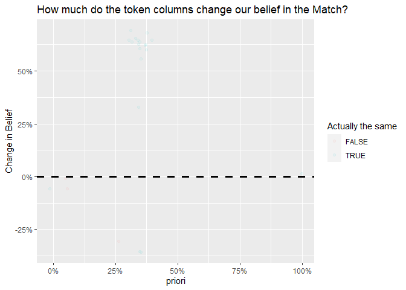

TokenLink
================
2022-05-05

# TokenLink

link two dataset using tokens or words in common between them

# Install Libraries

``` r
source('R/tokenify.R')
devtools::install_github("csps-efpc/TokenLink")
```

## Load Libraries

``` r
library(reclin)
library(tidyverse)
library(purrr)

data_dir <- 'data'
```

## Load in two datasets

``` r
orig_dat <- 
  data_dir |> 
  file.path('generated_dataset.csv') |>
  read_csv() |>
  replace_na(list(company_name = '', 
                  address = '', 
                  first_name = '', 
                  last_name = '', 
                  age = 0 
                  ))|>
  mutate_all(as.character)

edited_dat <- 
  data_dir |> 
  file.path('generated_dataset_random_edits.csv') |>
  read_csv() |>
  replace_na(list(company_name = '', 
                  address = '', 
                  first_name = '', 
                  last_name = '', 
                  age = 0 
                  )) |>
  mutate_all(as.character)


bind_cols(orig_dat, edited_dat |> rename_all(\(x){paste0(x,"_edited")})) |> 
  {\(.)select(., order(colnames(.)))}() |>
  sample_n(5) |> 
  knitr::kable(caption = 'original and edited data')
```

| address                             | address_edited                                 | age | age_edited | company_name                                | company_name_edited                         | first_name  | first_name_edited | last_name  | last_name_edited |
|:------------------------------------|:-----------------------------------------------|:----|:-----------|:--------------------------------------------|:--------------------------------------------|:------------|:------------------|:-----------|:-----------------|
| Wyoming Amsterdam                   | Wyoming Amsterdam                              | 21  | 21         | Forklift Matters Auto Limited               | Forklift ethane Auto Limited                | Anthony     | Anthony           | Bairam     | Bairaim          |
| Westfalen Finland South States      | Westfalen Finland South States                 | 79  | 79         | Limited_liability                           | Limited_liability                           | Christian   | Christin          | Freundlich | Freundlich       |
| Streetsboro Italy                   | Italy oilskin                                  | 47  | 47         | Trihodos Music                              | Trihodos Music                              | Sofia       | Sofia             | Cumming    | Cuming           |
| Heibei Oklahoma Michigan New United | Heibei Oklahoma zinky Michigan New United      | 76  | 76         | Nayrim Straylight Limited_liability Limited | Nayrim Straylight Limited_liability Limited | Christopher | Christopher       | Renouf     | Renouf           |
| Äÿ Finland Netherlands Texas        | Äÿ immobilizing Netherlands Texas immobilizing | 71  | 71         | Corridor Board                              | Board                                       | Sofia       | Sofia             | Wittig     | Wittig           |

original and edited data

## Block Pairs by First Name or Last Name is the same, as wll any

``` r
blocked_pairs <- reclin_pair_blocking(x = orig_dat,
                                      y = edited_dat, 
                                      blocking_var = c('first_name', 'last_name'), #Block on Any of these Columns
                                      token_types =  c('company_name', 'address'), #Block on Any of these tokens
                                      col_nms_x = c('company_name', 'address'),    # Column Names
                                      col_nms_y =  c('company_name', 'address'),   # Column Names
                                      min_token_u_prob = 0.0000784)               # min u_prob to consider blocking on

blocked_pairs
```

    ## Simple blocking
    ##   Blocking variable(s): first_name
    ##   First data set:  2 500 records
    ##   Second data set: 2 500 records
    ##   Total number of pairs: 97 192 pairs
    ## 
    ## Showing first 20 pairs:
    ##    x   y
    ## 1  1   2
    ## 2  1  15
    ## 3  1  62
    ## 4  1 111
    ## 5  1 153
    ## 6  1 261
    ## 7  1 322
    ## 8  1 329
    ## 9  1 349
    ## 10 1 389
    ## 11 1 411
    ## 12 1 469
    ## 13 1 470
    ## 14 1 486
    ## 15 1 522
    ## 16 1 610
    ## 17 1 634
    ## 18 1 676
    ## 19 1 724
    ## 20 1 726

## Generate Reclin EM Scores

``` r
# Compare pairs in Reclin using First and last name
p <- reclin::compare_pairs(blocked_pairs, 
                   by = c('first_name', 'last_name'),
                    default_comparator = jaro_winkler(0.9))

m <- problink_em(p)
p <- score_simsum(p, var = "sim_sum")
p <- score_problink(p, model = m, var = "scores", type  = 'all')

p |>
  sample_n(5) |>
  knitr::kable(caption = 'Show scores cenerated from Reclin')
```

|    x |    y | first_name | last_name |   sim_sum | scores_mprob | scores_uprob | scores_mpost | scores_upost | scores_weight |
|-----:|-----:|-----------:|----------:|----------:|-------------:|-------------:|-------------:|-------------:|--------------:|
|  393 |  186 |  1.0000000 | 0.0000000 | 1.0000000 |    0.8754236 |    0.6577243 |    0.1134210 |    0.8865790 |     0.2859220 |
| 1008 |  366 |  0.4416667 | 0.0000000 | 0.4416667 |    0.3924216 |    0.4747121 |    0.0736071 |    0.9263929 |    -0.1903717 |
|  892 |  283 |  1.0000000 | 0.5555556 | 1.5555556 |    0.4517976 |    0.2968852 |    0.1276056 |    0.8723944 |     0.4198887 |
| 1356 | 2268 |  1.0000000 | 0.4305556 | 1.4305556 |    0.5471135 |    0.3780740 |    0.1221078 |    0.8778922 |     0.3695662 |
| 2248 |  747 |  0.4416667 | 0.0000000 | 0.4416667 |    0.3924216 |    0.4747121 |    0.0736071 |    0.9263929 |    -0.1903717 |

Show scores cenerated from Reclin

## Refine the priori from reclin as a posterior taking into acount aditional information

``` r
refined_p <- 
  refine_posterior(p = p, 
                   x_dat = orig_dat, 
                   y_dat = edited_dat, 
                   weights_nm = 'scores_weight',
                   args_x = list(col_nms = c('company_name', 'address')),
                   args_y = list(col_nms = c('company_name', 'address')),
                   token_types = c('company_name', 'address')
                   )

refined_p |> 
  mutate(is_same = (x == y)) |>
  mutate(delta_belief = posterior - priori) |> 
  ggplot(aes(y = delta_belief, x = priori,  color = is_same )) + 
  geom_jitter(alpha = 0.05, width = 0.05, height = 0.05) +
  geom_hline(yintercept=0, linetype="dashed", color = "black", size = 1.25) +
  scale_x_continuous(labels = scales::percent) +
  scale_y_continuous(labels = scales::percent) +
  labs(title = 'How much do the token columns change our belief in the Match?',
       y = 'Change in Belief', 
       color = 'Actually the same')
```

<!-- -->
