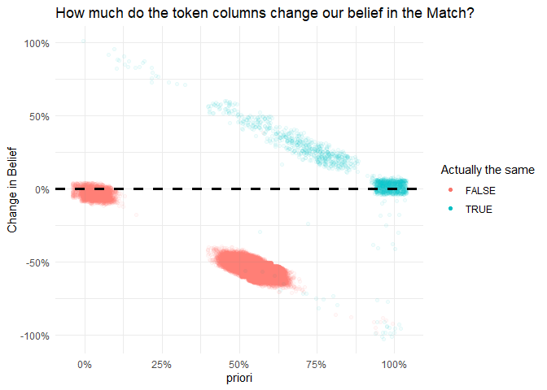

TokenLink
================
2022-05-05

Link two data sets using tokens or words in common between them.

# Install Libraries

``` r
source('R/tokenify.R')
devtools::install_github("csps-efpc/TokenLink")
```

## Load Libraries

``` r
library(reclin)
library(tidyverse)
library(purrr)
theme_set(theme_minimal())
data_dir <- file.path('..','data')
```

## Load in two datasets

``` r
orig_dat <- 
  data_dir |> 
  file.path('generated_dataset.csv') |>
  read_csv() |>
  replace_na(list(company_name = '', 
                  address = '', 
                  first_name = '', 
                  last_name = '', 
                  age = 0 
                  ))|>
  mutate_all(as.character)

edited_dat <- 
  data_dir |> 
  file.path('generated_dataset_random_edits.csv') |>
  read_csv() |>
  replace_na(list(company_name = '', 
                  address = '', 
                  first_name = '', 
                  last_name = '', 
                  age = 0 
                  )) |>
  mutate_all(as.character)


bind_cols(orig_dat, edited_dat |> rename_all(\(x){paste0(x,"_edited")})) |> 
  {\(.)select(., order(colnames(.)))}() |>
  sample_n(5) |> 
  knitr::kable(caption = 'original and edited data')
```

| address                                    | address_edited                                                          | age | age_edited | company_name                           | company_name_edited               | first_name | first_name_edited | last_name  | last_name_edited   |
|:-------------------------------------------|:------------------------------------------------------------------------|:----|:-----------|:---------------------------------------|:----------------------------------|:-----------|:------------------|:-----------|:-------------------|
| Sweet Alto United                          | rescoring Alto United                                                   | 58  | 58         | Artigianmobili Oxigen Edge             | Artigianmobili Oxigen Edge        | Noah       | Noah              | Fornicola  | Fornicola          |
| Paso United                                | Paso United                                                             | 73  | 73         | And Limited                            | And Limited                       | Angelina   | Angelina crested  | Rossingnol | Rossingnol bricole |
| Flanders Fort                              | Flanders Fort                                                           | 25  | 25         | Artimage Presentations Norway Business | Artimage Norway basinets Business | Noah       | Noah              | Isaacsen   | Isaacsexn          |
| Caracas Oakland Emirates California States | Caracas Oakland Emirates lapsible California lapsible States            | 30  | 30         | A0 Coaching Grupo Marketing            | A0 Marketing cranches             | Aaron      | ranonl            | Kinroth    | Kinroth            |
| Maidstone Rico Louisiana States United     | Maidstone thriftless Rico Louisiana thriftless States thriftless United | 36  | 36         | Satellite Law Solutions                | labiodentals Law                  | Mila       | Mila              | Clover     | Cloverw            |

original and edited data

## Block Pairs by First Name or Last Name is the same, as well any company_name or address fields that have a word in common that is not to common.

``` r
blocked_pairs <- reclin_pair_blocking(x = orig_dat,
                                      y = edited_dat, 
                                      blocking_var = c('first_name', 'last_name'), #Block on Any of these Columns
                                      token_types =  c('company_name', 'address'), #Block on Any of these tokens
                                      col_nms_x = c('company_name', 'address'),    # Column Names
                                      col_nms_y =  c('company_name', 'address'),   # Column Names
                                      min_token_u_prob = 0.0000784)               # min u_prob to consider blocking on

blocked_pairs |>
  as_tibble() 
```

    ## # A tibble: 37,341 x 2
    ##        x     y
    ##    <int> <int>
    ##  1     1    71
    ##  2     1   134
    ##  3     1   158
    ##  4     1   235
    ##  5     1   275
    ##  6     1   289
    ##  7     1   355
    ##  8     1   422
    ##  9     1   452
    ## 10     1   454
    ## # ... with 37,331 more rows

## Generate Reclin EM Scores

``` r
# Compare pairs in Reclin using First and last name
p <- reclin::compare_pairs(blocked_pairs, 
                   by = c('first_name', 'last_name'),
                    default_comparator = jaro_winkler(0.9))

m <- problink_em(p)
p <- score_simsum(p, var = "sim_sum")
p <- score_problink(p, model = m, var = "scores", type  = 'all')

p |>
  sample_n(5) |>
  knitr::kable(caption = 'Show scores cenerated from Reclin')
```

|    x |    y | first_name | last_name |   sim_sum | scores_mprob | scores_uprob | scores_mpost | scores_upost | scores_weight |
|-----:|-----:|-----------:|----------:|----------:|-------------:|-------------:|-------------:|-------------:|--------------:|
|   74 |   74 |          1 | 0.8148148 | 1.8148148 |    0.2943729 |    0.1335208 |    0.1900404 |    0.8099596 |     0.7905900 |
|  212 |  378 |          0 | 0.4416667 | 0.4416667 |    0.0108210 |    0.1781999 |    0.0064209 |    0.9935791 |    -2.8014156 |
| 1337 |  267 |          1 | 0.5111111 | 1.5111111 |    0.4830224 |    0.3325376 |    0.1338860 |    0.8661140 |     0.3733101 |
|  484 | 1446 |          1 | 0.4722222 | 1.4722222 |    0.5071787 |    0.3580214 |    0.1310089 |    0.8689911 |     0.3482705 |
|  864 |  657 |          1 | 0.4259259 | 1.4259259 |    0.5359363 |    0.3883594 |    0.1280564 |    0.8719436 |     0.3220841 |

Show scores cenerated from Reclin

## Refine the priori from reclin as a posterior taking into acount aditional information

``` r
print(getwd())
```

    ## [1] "C:/Users/hswerdfe/projects/TokenLink/vignettes"

``` r
refined_p <- 
  refine_posterior(p = p, 
                   x_dat = orig_dat, 
                   y_dat = edited_dat, 
                   weights_nm = 'scores_weight',
                   args_x = list(col_nms = c('company_name', 'address')),
                   args_y = list(col_nms = c('company_name', 'address')),
                   token_types = c('company_name', 'address')
                   )

refined_p |> 
  mutate(is_same = (x == y)) |>
  mutate(delta_belief = posterior - priori) |> 
  ggplot(aes(y = delta_belief, x = priori,  color = is_same )) + 
  geom_jitter(alpha = 0.05, width = 0.05, height = 0.05) +
  geom_hline(yintercept=0, linetype="dashed", color = "black", size = 1.25) +
  scale_x_continuous(labels = scales::percent) +
  scale_y_continuous(labels = scales::percent) +
  labs(title = 'How much do the token columns change our belief in the Match?',
       y = 'Change in Belief', 
       color = 'Actually the same') + 
  guides(colour = guide_legend(override.aes = list(alpha = 1)))
```

<!-- -->
